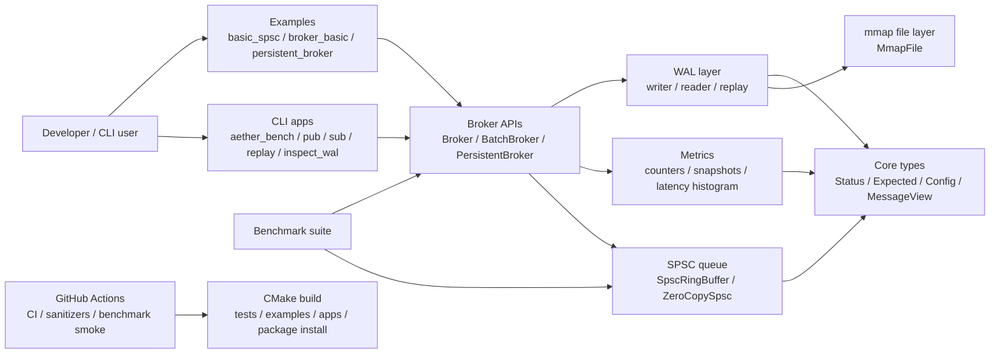
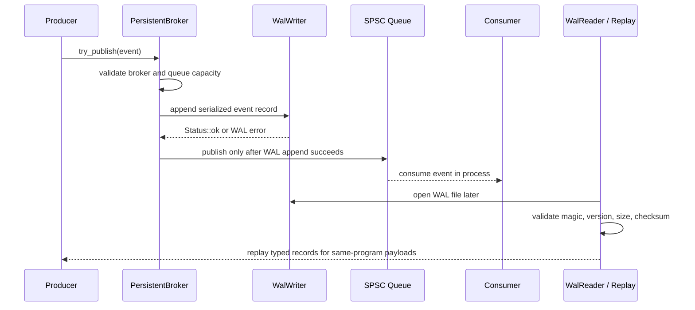

<div align="center">

# Aether-Stream

### Local C++20 message-broker toolkit with bounded low-latency primitives

Aether-Stream is a local C++20 message-broker toolkit for studying and demonstrating low-latency-oriented messaging primitives in a carefully bounded environment. It combines a single-producer/single-consumer lock-free queue, broker-style APIs, mmap-backed write-ahead logging, replay tools, metrics, CLI demos, benchmarks, and CI verification.

It is intentionally local-first: no networking, no distributed cluster, no live cross-process broker service, and no production-readiness claim. The value of the project is in the correctness-focused implementation of queueing, persistence, diagnostics, benchmark discipline, and build automation.

<br/>

[](CMakeLists.txt)
[](CMakeLists.txt)
[](scripts/run_tests.sh)
[](docs/ring-buffer-design.md)
[](docs/wal-format.md)
[](docs/mmap-notes.md)
[](https://github.com/AyushmanRaha/Aether-Stream/actions/workflows/ci.yml)
[](https://github.com/AyushmanRaha/Aether-Stream/actions/workflows/sanitizer.yml)
[](https://github.com/AyushmanRaha/Aether-Stream/actions/workflows/benchmark-smoke.yml)
[](LICENSE)

<br/>

**Local library and CLI toolkit. Explicit limitations. No unsupported benchmark numbers.**

<p align="center">
  <a href="#what-aether-stream-does"><strong>Overview</strong></a> ·
  <a href="#quick-start"><strong>Quick Start</strong></a> ·
  <a href="#architecture-at-a-glance"><strong>Architecture</strong></a> ·
  <a href="#benchmarks"><strong>Benchmarks</strong></a> ·
  <a href="#docs-and-deep-dives"><strong>Docs</strong></a>
</p>

</div>

---

## Table of Contents

- [What Aether-Stream does](#what-aether-stream-does)
- [Technical depth](#technical-depth)
- [What is included vs intentionally not claimed](#what-is-included-vs-intentionally-not-claimed)
- [Architecture at a glance](#architecture-at-a-glance)
- [Core feature tour](#core-feature-tour)
- [Quick Start](#quick-start)
- [Build and test locally](#build-and-test-locally)
- [CLI demo flow](#cli-demo-flow)
- [Benchmarks](#benchmarks)
- [Docs and deep dives](#docs-and-deep-dives)
- [Testing and CI](#testing-and-ci)
- [Limitations and honesty notes](#limitations-and-honesty-notes)
- [Project structure](#project-structure)
- [Contributing](#contributing)
- [License](#license)
- [Acknowledgements](#acknowledgements)

## What Aether-Stream does

Aether-Stream provides local messaging building blocks that can be read, tested, benchmarked, and extended without introducing service infrastructure. The repository contains a reusable C++20 library, examples, CLI tools, CTest coverage, benchmark targets, and documentation for the queueing, WAL, broker, metrics, and build systems.

For non-technical reviewers: this project shows how a local message can move through a bounded queue, optionally be written to a local log file first, be replayed later, and be measured with diagnostics. For technical reviewers: the interesting parts are the SPSC synchronization contract, raw slot lifetime management, WAL record validation, mmap resource handling, typed replay constraints, relaxed metrics counters, and repeatable verification workflow.

## Technical depth

| Capability | Codebase-grounded behavior |
|---|---|
| Lock-free SPSC queue | Uses acquire/release publication, cache-line padding, raw slot lifetime management, and stress tests. |
| Broker APIs | Provides in-memory, batch, and WAL-backed wrappers over the SPSC queue. |
| WAL persistence | Appends validated fixed-format records before queue publication in the persistent broker. |
| mmap file abstraction | Wraps POSIX mapping behind RAII and reports unsupported behavior where native support is not implemented. |
| Metrics and diagnostics | Provides counters, snapshots, latency histogram, and CLI summaries. |
| Benchmark discipline | Uses benchmark executables, a raw-output runner, and published redacted local results with limitations. |
| Build verification | CMake options cover tests, examples, tools, apps, benchmarks, sanitizers, clang-tidy, and install/export checks. |

## What is included vs intentionally not claimed

| Area | Included | Not claimed |
|---|---|---|
| Queue | `SpscRingBuffer<T, Capacity>` and experimental `ZeroCopySpsc<T, Capacity>`. | MPSC/MPMC queues or blocking wait primitives. |
| Broker | `Broker`, `BatchBroker`, and `PersistentBroker` local APIs. | Distributed broker semantics or live inter-process subscriptions. |
| WAL | Fixed-size mmap-backed append/read/replay with CRC32 validation. | WAL rotation, repair tooling, schema evolution, or production crash recovery. |
| CLI | `aether_bench`, `aether_pub`, `aether_sub`, `aether_replay`, `aether_inspect_wal`. | Network clients, daemons, auth, TLS, or service discovery. |
| Benchmarks | Benchmark executables, canonical raw-output runner, and redacted local result documentation. | Production guarantees or distributed-system comparisons. |
| CI | Format, build, CTest, sanitizer, clang-tidy, benchmark smoke, and package smoke workflows. | Proof of production readiness. |
| Platform support | Linux/macOS-oriented development path; WSL2 recommended for Windows users. | Fully verified native Windows mmap/test behavior. |

## Architecture at a glance





## Core feature tour

### Lock-free SPSC queue

`SpscRingBuffer<T, Capacity>` is a header-only queue for exactly one producer and one consumer. It uses monotonic logical counters, power-of-two slot masking, acquire/release publication, cache-line separation, and raw storage lifetime management.

### Broker APIs

`Broker<T, Capacity>` provides a local publish/consume wrapper over the queue. `BatchBroker<T, Capacity>` adds batch-oriented publish/consume APIs. `PersistentBroker<T, Capacity>` composes the queue with the WAL writer and reader.

### WAL persistence and replay

The WAL layer stores records with a 40-byte little-endian v1 header, payload bytes, and CRC32 validation. Persistent broker publishing uses WAL-before-queue semantics: a value is published to the in-process queue only after the WAL append succeeds.

### CLI toolkit

The CLI apps demonstrate local benchmark-style broker flow, WAL publishing, typed replay, raw replay, and WAL inspection. `aether_sub` is a local subscriber/replay demo, not a network subscriber.

### Metrics and diagnostics

Broker metrics use relaxed-atomic counters and immutable snapshots. The latency histogram supports diagnostic and benchmark summaries without introducing an external observability dependency.

### Benchmark suite

Benchmark targets cover SPSC throughput, SPSC latency, payload-size comparison, broker end-to-end flow, batch publishing, zero-copy SPSC, and spin-wait primitives. Reported numbers must come from preserved benchmark evidence.

### Low-latency-oriented utilities

`BatchBroker`, experimental `ZeroCopySpsc`, `SpinWait`, `cpu_relax`, and CPU affinity helpers are comparison and exploration APIs. They are not a latency guarantee and do not change the project into a production messaging system.

## Quick Start

```sh
git clone https://github.com/AyushmanRaha/Aether-Stream.git
cd Aether-Stream
cmake -S . -B build/debug -G Ninja -DCMAKE_BUILD_TYPE=Debug \
  -DAETHER_BUILD_TESTS=ON \
  -DAETHER_BUILD_EXAMPLES=ON \
  -DAETHER_BUILD_TOOLS=ON \
  -DAETHER_BUILD_APPS=ON \
  -DAETHER_BUILD_BENCHMARKS=OFF
cmake --build build/debug
ctest --test-dir build/debug --output-on-failure
./build/debug/examples/smoke
```

Expected smoke output:

```text
Aether-Stream 0.1.0
```

## Build and test locally

### macOS

```bash
brew install cmake ninja
git clone https://github.com/AyushmanRaha/Aether-Stream.git
cd Aether-Stream

cmake -S . -B build/debug -G Ninja \
  -DCMAKE_BUILD_TYPE=Debug \
  -DAETHER_BUILD_TESTS=ON \
  -DAETHER_BUILD_EXAMPLES=ON \
  -DAETHER_BUILD_TOOLS=ON \
  -DAETHER_BUILD_APPS=ON \
  -DAETHER_BUILD_BENCHMARKS=OFF

cmake --build build/debug
ctest --test-dir build/debug --output-on-failure
./build/debug/examples/smoke
```

Run benchmarks separately only when you want local benchmark output:

```bash
./scripts/run_benchmarks.sh
```

### Linux

```bash
sudo apt-get update
sudo apt-get install -y build-essential cmake ninja-build git

git clone https://github.com/AyushmanRaha/Aether-Stream.git
cd Aether-Stream

cmake -S . -B build/debug -G Ninja \
  -DCMAKE_BUILD_TYPE=Debug \
  -DAETHER_BUILD_TESTS=ON \
  -DAETHER_BUILD_EXAMPLES=ON \
  -DAETHER_BUILD_TOOLS=ON \
  -DAETHER_BUILD_APPS=ON \
  -DAETHER_BUILD_BENCHMARKS=OFF

cmake --build build/debug
ctest --test-dir build/debug --output-on-failure
./build/debug/examples/smoke
```

Run benchmarks separately only when you want local benchmark output:

```bash
./scripts/run_benchmarks.sh
```

### Windows

The recommended Windows path is WSL2 because the current mmap implementation is POSIX-oriented and native Windows testing is not presented as fully verified.

From PowerShell:

```powershell
wsl --install
```

Then inside Ubuntu on WSL:

```bash
sudo apt-get update
sudo apt-get install -y build-essential cmake ninja-build git

git clone https://github.com/AyushmanRaha/Aether-Stream.git
cd Aether-Stream

cmake -S . -B build/debug -G Ninja \
  -DCMAKE_BUILD_TYPE=Debug \
  -DAETHER_BUILD_TESTS=ON \
  -DAETHER_BUILD_EXAMPLES=ON \
  -DAETHER_BUILD_TOOLS=ON \
  -DAETHER_BUILD_APPS=ON \
  -DAETHER_BUILD_BENCHMARKS=OFF

cmake --build build/debug
ctest --test-dir build/debug --output-on-failure
./build/debug/examples/smoke
```

## CLI demo flow

```sh
cmake -S . -B build/release -G Ninja -DCMAKE_BUILD_TYPE=Release \
  -DAETHER_BUILD_TESTS=ON \
  -DAETHER_BUILD_EXAMPLES=ON \
  -DAETHER_BUILD_TOOLS=ON \
  -DAETHER_BUILD_APPS=ON
cmake --build build/release

./build/release/apps/aether_bench --messages 100000 --payload-size 64 --capacity 1024
./build/release/apps/aether_pub --wal data/sample.wal --messages 1000
./build/release/apps/aether_inspect_wal --wal data/sample.wal
./build/release/apps/aether_replay --wal data/sample.wal --limit 10
./build/release/apps/aether_sub --wal data/sample.wal --limit 10
```

## Benchmarks

Aether-Stream includes local benchmark executables for SPSC throughput, SPSC latency, payload-size behavior, broker end-to-end flow, batch publishing, zero-copy SPSC, and spin-wait primitives. See the [benchmark methodology](docs/benchmark-methodology.md) for the publication rules.

Published local benchmark results are available in [Performance results](docs/performance-results.md), with the detailed consolidated evidence in [M1 MacBook Air benchmark run — 2026-06-29](docs/benchmark-results/m1-macbook-air-2026-06-29.md). The detailed file preserves the benchmark values in a single redacted Markdown transcript rather than adding separate raw `.txt` or `.json` files.

These are local synthetic measurements from a redacted Apple M1 MacBook Air run. They are useful for understanding implementation tradeoffs, but they are not production guarantees and do not measure networking, distributed messaging, or cross-process service behavior.

```sh
./scripts/run_benchmarks.sh
```

## Docs and deep dives

| Document | Purpose |
|---|---|
| [Repository guide](docs/repository-guide.md) | Current repository layout, targets, options, and verification map. |
| [Concepts guide](docs/concepts-guide.md) | Technical primer for the main C++20, SPSC, WAL, broker, metrics, benchmark, and build concepts. |
| [Architecture](docs/architecture.md) | System overview and component flow diagrams. |
| [Ring buffer design](docs/ring-buffer-design.md) | SPSC queue API, slot lifecycle, memory ordering, and tests. |
| [Memory ordering](docs/memory-ordering.md) | Acquire/release rationale for queue publication and reuse. |
| [mmap notes](docs/mmap-notes.md) | POSIX-oriented `MmapFile` behavior and non-goals. |
| [WAL format](docs/wal-format.md) | Record layout, checksum policy, reader behavior, and replay limits. |
| [Broker API](docs/broker-api.md) | In-memory, batch, and persistent broker usage and limitations. |
| [CLI guide](docs/cli-guide.md) | Local CLI apps, demo flow, and output expectations. |
| [Metrics](docs/metrics.md) | Counters, snapshots, latency histogram, and CLI summaries. |
| [Benchmark methodology](docs/benchmark-methodology.md) | How to run, preserve, and publish benchmark results honestly. |
| [Performance results](docs/performance-results.md) | Summarized local benchmark results and caveats. |
| [M1 MacBook Air benchmark run — 2026-06-29](docs/benchmark-results/m1-macbook-air-2026-06-29.md) | Consolidated redacted benchmark evidence for the published local run. |
| [Low-latency tuning](docs/low-latency-tuning.md) | Practical tuning notes for batching, zero-copy, spin waits, and affinity. |
| [Low-latency design notes](docs/low-latency-design-notes.md) | Design tradeoffs and limits for latency-oriented primitives. |
| [Limitations](docs/limitations.md) | Explicit project boundaries and unsupported behavior. |
| [Release checklist](docs/release-checklist.md) | Pre-tag verification checklist. |

## Testing and CI

| Check | Command or workflow |
|---|---|
| Format | `./scripts/format_all.sh --check` |
| Debug tests | `cmake -S . -B build/debug -G Ninja -DCMAKE_BUILD_TYPE=Debug -DAETHER_BUILD_TESTS=ON -DAETHER_BUILD_EXAMPLES=ON -DAETHER_BUILD_TOOLS=ON -DAETHER_BUILD_APPS=ON && cmake --build build/debug && ctest --test-dir build/debug --output-on-failure` |
| ASAN/UBSAN | `cmake -S . -B build/asan -G Ninja -DCMAKE_BUILD_TYPE=Debug -DAETHER_BUILD_TESTS=ON -DAETHER_ENABLE_ASAN=ON -DAETHER_ENABLE_UBSAN=ON && cmake --build build/asan && ctest --test-dir build/asan --output-on-failure` |
| TSAN | `cmake -S . -B build/tsan -G Ninja -DCMAKE_BUILD_TYPE=Debug -DAETHER_BUILD_TESTS=ON -DAETHER_ENABLE_TSAN=ON && cmake --build build/tsan && ctest --test-dir build/tsan --output-on-failure` |
| Package install | `cmake -S . -B build/package -G Ninja -DCMAKE_BUILD_TYPE=Release -DAETHER_BUILD_TESTS=ON -DAETHER_ENABLE_INSTALL=ON && cmake --build build/package && ctest --test-dir build/package --output-on-failure && cmake --install build/package --prefix install/aether` |
| CI workflow | `.github/workflows/ci.yml` |
| Sanitizer workflow | `.github/workflows/sanitizer.yml` |
| Benchmark smoke workflow | `.github/workflows/benchmark-smoke.yml` |

## Limitations and honesty notes

- The queue APIs are SPSC only.
- There is no networking, daemon, cluster, live IPC broker service, replication, auth, TLS, or service discovery.
- WAL storage is fixed-size and local; there is no rotation, compaction, repair, or production recovery tooling.
- Typed replay is intended for trivially copyable same-program/same-platform payloads.
- CPU affinity behavior is platform-dependent.
- Native Windows support is not presented as fully verified; WSL2 is the recommended Windows path.
- Benchmark smoke checks and stress tests are not official performance results.
- Published benchmark results are local synthetic measurements with redacted environment details; they are not production guarantees.

## Project structure

```text
.
├── apps/                    CLI applications
├── benchmarks/              Benchmark executables
├── cmake/                   Reusable CMake modules
├── docs/                    Architecture, API, benchmark, and limitation docs
├── examples/                Small runnable examples
├── include/aether/          Public C++20 headers
├── scripts/                 Local build, test, format, and benchmark helpers
├── src/                     Library implementation files
├── tests/                   CTest executables
└── tools/                   Manual validation tools
```

## Contributing

See [CONTRIBUTING.md](CONTRIBUTING.md). Keep changes focused, run relevant checks, preserve benchmark honesty, and update documentation when behavior or limitations change.

## License

Aether-Stream is released under the MIT License. See [LICENSE](LICENSE).

## Acknowledgements

This project uses C++20, CMake, Ninja-compatible build flows, CTest, the Google Benchmark library, clang-format, clang-tidy, sanitizers, and GitHub Actions to demonstrate practical systems engineering habits around a deliberately scoped local message-broker toolkit.
