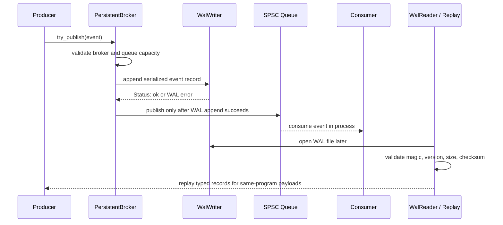

<div align="center">

# Aether-Stream

### C++20 ultra-low-latency lock-free message broker toolkit

Aether-Stream is a C++20 systems project that demonstrates a local lock-free SPSC queue, in-memory and WAL-backed broker APIs, mmap-backed write-ahead logging, metrics, CLI demos, Google Benchmark coverage, CI quality gates, and low-latency design tradeoffs while keeping its limitations explicit and measurable.

<br/>

[](CMakeLists.txt)
[](CMakeLists.txt)
[](scripts/run_tests.sh)
[](docs/ring-buffer-design.md)
[](docs/wal-format.md)
[](docs/mmap-notes.md)
[](https://github.com/AyushmanRaha/Aether-Stream/actions/workflows/ci.yml)
[](https://github.com/AyushmanRaha/Aether-Stream/actions/workflows/sanitizer.yml)
[](https://github.com/AyushmanRaha/Aether-Stream/actions/workflows/benchmark-smoke.yml)
[](LICENSE)

<br/>

**Local C++ library and CLI toolkit. No networking claims. No fake HFT claims. No unsupported benchmark numbers.**

<p align="center">
  <a href="#what-aether-stream-does"><strong>Overview</strong></a> ·
  <a href="#quick-start"><strong>Quick Start</strong></a> ·
  <a href="#architecture-at-a-glance"><strong>Architecture</strong></a> ·
  <a href="#benchmarks-and-performance-reporting"><strong>Benchmarks</strong></a> ·
  <a href="#docs-and-deep-dives"><strong>Docs</strong></a>
</p>

</div>

---

## Table of Contents

- [What Aether-Stream does](#what-aether-stream-does)
- [Why it is technically strong](#why-it-is-technically-strong)
- [What I built vs what it intentionally does not do](#what-i-built-vs-what-it-intentionally-does-not-do)
- [Architecture at a glance](#architecture-at-a-glance)
- [Core feature tour](#core-feature-tour)
- [Quick Start](#quick-start)
- [Choose your setup path](#choose-your-setup-path)
- [Build, test, and verification matrix](#build-test-and-verification-matrix)
- [CLI demo flow](#cli-demo-flow)
- [Benchmarks and performance reporting](#benchmarks-and-performance-reporting)
- [Docs and deep dives](#docs-and-deep-dives)
- [Testing and CI](#testing-and-ci)
- [Limitations and honesty notes](#limitations-and-honesty-notes)
- [Project structure](#project-structure)
- [Interview-ready explanation](#interview-ready-explanation)
- [Contributing](#contributing)
- [License](#license)
- [Acknowledgements](#acknowledgements)

## What Aether-Stream does

Aether-Stream is a local C++20 library and CLI toolkit for exploring low-latency messaging building blocks. It includes a lock-free `SpscRingBuffer<T, Capacity>` for exactly one producer and one consumer, broker wrappers over the queue, a persistent broker that appends to an mmap-backed WAL before queue publication, demo CLI apps for publishing/replay/inspection, metrics snapshots and latency histograms, reproducible benchmark tooling, and CI quality automation.

It is complete through Phase 13: the implementation remains Phase 0-12 runtime functionality, while Phase 13 adds portfolio documentation, Mermaid diagrams, release notes, limitations, and interview-readiness polish.

## Why it is technically strong

| Capability | Production-oriented behavior |
|---|---|
| Lock-free SPSC queue | Uses acquire/release publication, cache-line padding, raw slot lifetime management, and stress tests. |
| WAL-backed persistent broker | Appends to WAL before queue publication for typed same-platform replay. |
| mmap file abstraction | Isolates POSIX file mapping behind RAII. |
| Metrics and diagnostics | Local counters, snapshots, latency histograms, CLI metrics summaries. |
| Benchmark discipline | Release benchmark runner captures environment and raw outputs. |
| CI and quality gates | CI, sanitizers, clang-tidy, format checks, benchmark smoke, package install smoke. |
| Low-latency exploration | Batch APIs, experimental zero-copy SPSC, spin waits, Linux-first CPU affinity helper. |

## What I built vs what it intentionally does not do

| Area | Built in this project | Intentionally not claimed |
|---|---|---|
| Queue | Lock-free SPSC ring buffer and experimental zero-copy SPSC API. | MPSC/MPMC queues or blocking wait primitives. |
| Broker | In-memory `Broker`, `BatchBroker`, and `PersistentBroker` wrappers. | Distributed broker semantics or live inter-process subscriptions. |
| WAL | Fixed-size mmap-backed append/read/replay with CRC32 validation. | WAL rotation, repair tooling, schema evolution, or production crash recovery. |
| CLI | `aether_bench`, `aether_pub`, `aether_sub`, `aether_replay`, `aether_inspect_wal`. | Network clients, daemons, auth, TLS, or service discovery. |
| Benchmarks | Google Benchmark executables and canonical raw-output runner. | Official numbers without committed raw outputs. |
| CI | Format, build, CTest, sanitizer, clang-tidy, benchmark smoke, package smoke workflows. | Proof of production readiness. |
| Production messaging | Clear local building blocks and honest limitations. | Production broker, IPC service, or HA/distributed guarantees. |
| HFT claims | HFT-style design notes and low-latency comparison APIs. | HFT-ready claims or latency guarantees. |

## Architecture at a glance

```mermaid
flowchart LR
    Producer["Producer thread<br/>owns head_"] --> CheckSpace["Acquire-load tail_<br/>check free space"]
    CheckSpace --> Construct["Construct payload in<br/>buffer[head & mask]"]
    Construct --> PublishHead["Release-store head_ + 1"]
    PublishHead --> ConsumerAcquire["Consumer acquire-loads head_"]
    ConsumerAcquire --> Consume["Move payload out<br/>destroy slot"]
    Consume --> PublishTail["Release-store tail_ + 1"]
    PublishTail --> ProducerReuse["Producer acquire-loads tail_<br/>slot reusable"]
```






## Core feature tour

### Lock-free SPSC queue

`SpscRingBuffer<T, Capacity>` is a header-only queue for exactly one producer and one consumer. It uses monotonic logical counters, power-of-two slot masking, acquire/release publication, cache-line separation, and raw storage lifetime management.

### Broker APIs

`Broker<T, Capacity>` provides a local publish/consume wrapper over the queue. `BatchBroker<T, Capacity>` adds Phase 12 batch-oriented publish/consume APIs. `PersistentBroker<T, Capacity>` composes the queue with the WAL writer and reader.

### WAL persistence and replay

The WAL layer stores records with a 40-byte little-endian v1 header, payload bytes, and CRC32 validation. Persistent broker publishing uses WAL-before-queue semantics: a value is published to the in-process queue only after the WAL append succeeds.

### CLI toolkit

The CLI apps demonstrate local benchmark-style broker flow, WAL publishing, typed replay, raw replay, and WAL inspection. `aether_sub` is a local subscriber/replay demo, not a network subscriber.

### Metrics and diagnostics

Broker metrics use relaxed-atomic counters and snapshots. The latency histogram supports diagnostic and benchmark summaries without introducing an external observability dependency.

### Benchmark suite

Benchmark targets cover SPSC throughput, SPSC latency, payload-size comparison, broker end-to-end flow, batch publishing, zero-copy SPSC, and spin-wait primitives. Reported numbers must come from preserved raw outputs.

### Advanced low-latency APIs

Phase 12 added `BatchBroker`, experimental `ZeroCopySpsc`, `SpinWait`, `cpu_relax`, and Linux-first CPU affinity helpers. These are comparison and exploration APIs, not HFT-readiness claims.

### CI and packaging

CMake install/export rules expose `aether::stream`. GitHub Actions cover CI, sanitizers, clang-tidy, benchmark smoke, and package install smoke verification.

## Quick Start

```sh
git clone https://github.com/AyushmanRaha/Aether-Stream.git
cd Aether-Stream
cmake -S . -B build/debug -G Ninja -DCMAKE_BUILD_TYPE=Debug \
  -DAETHER_BUILD_TESTS=ON \
  -DAETHER_BUILD_EXAMPLES=ON \
  -DAETHER_BUILD_TOOLS=ON \
  -DAETHER_BUILD_APPS=ON
cmake --build build/debug
ctest --test-dir build/debug --output-on-failure
./build/debug/examples/smoke
```

Expected smoke output:

```text
Aether-Stream 0.1.0
```

## Choose your setup path

| Goal | Command path | Notes |
|---|---|---|
| Build and run tests | Configure Debug with `AETHER_BUILD_TESTS=ON`, build, then run CTest. | Fastest correctness path. |
| Run examples | Add `-DAETHER_BUILD_EXAMPLES=ON`, then run binaries in `build/debug/examples/`. | Includes SPSC, mmap, WAL, and broker examples. |
| Run CLI demos | Add `-DAETHER_BUILD_APPS=ON`, then run binaries in `build/*/apps/`. | Local demos only; no network service. |
| Run benchmarks | Run `./scripts/run_benchmarks.sh`. | Canonical Release workflow with raw outputs. |
| Run sanitizer build | Configure `build/asan` or `build/tsan` with sanitizer options. | TSAN should be separate from ASAN/UBSAN. |
| Verify package install | Configure Release with `-DAETHER_ENABLE_INSTALL=ON`, build, test, install. | Validates exported `aether::stream`. |

## Build, test, and verification matrix

| Check | Command |
|---|---|
| Format | `./scripts/format_all.sh --check` |
| Debug tests | `cmake -S . -B build/debug -G Ninja -DCMAKE_BUILD_TYPE=Debug -DAETHER_BUILD_TESTS=ON -DAETHER_BUILD_EXAMPLES=ON -DAETHER_BUILD_TOOLS=ON -DAETHER_BUILD_APPS=ON && cmake --build build/debug && ctest --test-dir build/debug --output-on-failure` |
| ASAN/UBSAN | `cmake -S . -B build/asan -G Ninja -DCMAKE_BUILD_TYPE=Debug -DAETHER_BUILD_TESTS=ON -DAETHER_ENABLE_ASAN=ON -DAETHER_ENABLE_UBSAN=ON && cmake --build build/asan && ctest --test-dir build/asan --output-on-failure` |
| TSAN | `cmake -S . -B build/tsan -G Ninja -DCMAKE_BUILD_TYPE=Debug -DAETHER_BUILD_TESTS=ON -DAETHER_ENABLE_TSAN=ON && cmake --build build/tsan && ctest --test-dir build/tsan --output-on-failure` |
| Package install | `cmake -S . -B build/package -G Ninja -DCMAKE_BUILD_TYPE=Release -DAETHER_BUILD_TESTS=ON -DAETHER_ENABLE_INSTALL=ON && cmake --build build/package && ctest --test-dir build/package --output-on-failure && cmake --install build/package --prefix install/aether` |

## CLI demo flow

```sh
cmake -S . -B build/release -G Ninja -DCMAKE_BUILD_TYPE=Release \
  -DAETHER_BUILD_TESTS=ON \
  -DAETHER_BUILD_EXAMPLES=ON \
  -DAETHER_BUILD_TOOLS=ON \
  -DAETHER_BUILD_APPS=ON
cmake --build build/release

./build/release/apps/aether_bench --messages 100000 --payload-size 64 --capacity 1024
./build/release/apps/aether_pub --wal data/sample.wal --messages 1000
./build/release/apps/aether_inspect_wal --wal data/sample.wal
./build/release/apps/aether_replay --wal data/sample.wal --limit 10
./build/release/apps/aether_sub --wal data/sample.wal --limit 10
```

## Benchmarks and performance reporting

Run the canonical workflow from the repository root:

```sh
./scripts/run_benchmarks.sh
```

For shorter exploratory runs:

```sh
./scripts/run_benchmarks.sh --benchmark_min_time=0.5s
```

Raw `.txt`, `.json`, and `environment.txt` outputs are written under `benchmark-results/YYYYMMDD-HHMMSS/`. Official benchmark tables must only be populated from those raw outputs. If no raw measured output is committed, benchmark tables stay marked “not yet published”; this repository does not invent throughput, latency, p99, p999, or hardware claims.

## Docs and deep dives

| Document | Purpose |
|---|---|
| [Architecture](docs/architecture.md) | Layered system explanation and data flow. |
| [Ring buffer design](docs/ring-buffer-design.md) | SPSC algorithm, slot lifecycle, limitations, interview explanation. |
| [Memory ordering](docs/memory-ordering.md) | Acquire/release protocol and SPSC-only reasoning. |
| [WAL format](docs/wal-format.md) | 40-byte v1 record layout, checksum, replay, corruption semantics. |
| [Broker API](docs/broker-api.md) | In-memory and persistent broker usage. |
| [CLI guide](docs/cli-guide.md) | CLI app usage and demo flow. |
| [Metrics](docs/metrics.md) | Counters, snapshots, latency histogram. |
| [Benchmark methodology](docs/benchmark-methodology.md) | Canonical benchmark workflow and reporting rules. |
| [Performance results](docs/performance-results.md) | Publication template for measured results. |
| [Low-latency tuning](docs/low-latency-tuning.md) | Batch, zero-copy, spin-wait, affinity tradeoffs. |
| [HFT design notes](docs/hft-design-notes.md) | Honest HFT-style design discussion and limitations. |
| [Limitations](docs/limitations.md) | Current non-goals and production gaps. |
| [Interview notes](docs/interview-notes.md) | 30-second to deep-dive explanations and Q&A. |
| [Release checklist](docs/release-checklist.md) | Pre-tag verification checklist. |

## Testing and CI

CTest covers version/status/message behavior, SPSC basic/wraparound/concurrent/move-only/stress cases, mmap behavior, WAL record/writer/reader behavior, broker and persistent broker behavior, CLI argument parsing, metrics counters, latency histograms, batch broker behavior, and zero-copy SPSC behavior. WAL tests include partial-record, zero-filled tail, and corruption detection paths.

GitHub Actions provide CI builds, sanitizer workflow, benchmark-smoke workflow, clang-tidy integration, format checks, and package install smoke checks. These checks improve confidence, but they do not turn the project into a production broker.

## Limitations and honesty notes

- No networking, IPC broker service, or live cross-process subscriptions.
- No MPSC or MPMC queue; SPSC means exactly one producer and exactly one consumer.
- No production-ready or HFT-ready guarantee.
- No official performance numbers unless raw `./scripts/run_benchmarks.sh` outputs are committed and linked.
- Persistent typed replay is same-program/same-platform for trivially copyable payload types.
- macOS/laptop numbers are development measurements; final low-latency claims require controlled Linux benchmarking.
- The manual SPSC stress tool is for correctness validation, not benchmark reporting.

## Project structure

```text
Aether-Stream/
├── include/aether/          Public C++20 headers
├── src/                     Library implementation files
├── apps/                    CLI demo applications
├── examples/                Small usage examples
├── tests/                   Standalone CTest executables
├── benchmarks/              Google Benchmark executables
├── tools/                   Manual stress-validation tools
├── scripts/                 Format, test, and benchmark runners
├── cmake/                   CMake options, dependencies, install, sanitizers
├── docs/                    Architecture, design, benchmark, limitation docs
├── .github/workflows/       CI, sanitizer, benchmark-smoke workflows
├── README.md                Portfolio front page with inline Mermaid diagrams
├── CHANGELOG.md             Unreleased change tracking
└── RELEASE_NOTES_v0.1.0.md  v0.1.0 candidate release notes
```

## Interview-ready explanation

Aether-Stream is credible as a systems project because it connects low-level C++ mechanics to observable product-like tooling: lock-free SPSC memory ordering, raw object lifetime, cache-line avoidance, mmap RAII, WAL record validation, broker-level composition, metrics, CLI demos, benchmarks, and CI. The key tradeoff is scope discipline: the project demonstrates a carefully bounded local messaging stack instead of pretending to be a production distributed broker.

See [docs/interview-notes.md](docs/interview-notes.md) for pitch lengths, deep-dive outline, and likely interviewer Q&A.

## Contributing

See [CONTRIBUTING.md](CONTRIBUTING.md). Keep changes focused, run relevant checks, preserve benchmark honesty, and do not add new runtime features under Phase 13 documentation work.

## License

Aether-Stream is licensed under the [MIT License](LICENSE).

## Acknowledgements

This project uses C++20, CMake, Ninja-compatible build flows, CTest, Google Benchmark, clang-format, clang-tidy, sanitizers, and GitHub Actions to demonstrate practical systems engineering habits around a deliberately scoped local message broker toolkit.
