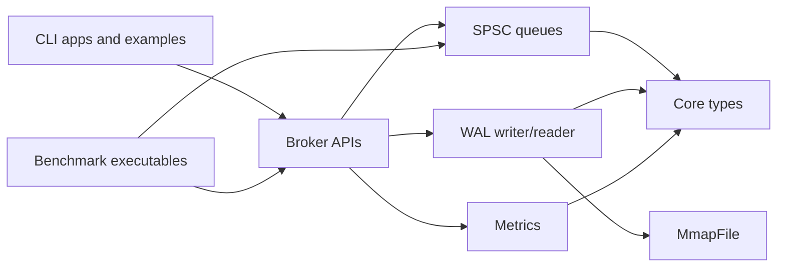
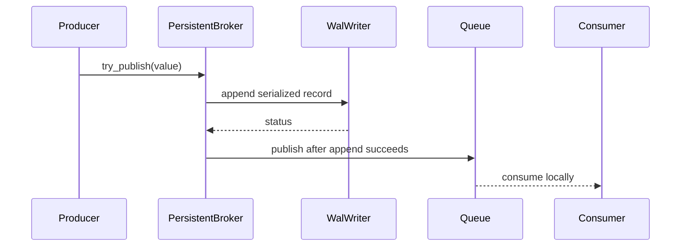

# Architecture

Aether-Stream is intentionally scoped as a local C++20 systems project. It demonstrates queueing, broker composition, persistence, metrics, benchmark tooling, and CI verification while keeping limitations explicit.

## Component overview

| Layer | Responsibility |
|---|---|
| Core | Version API, status values, expected-like wrapper, config structs, message views. |
| Queue | SPSC ring buffer and experimental zero-copy SPSC queue. |
| Broker | In-memory broker, batch broker, and persistent broker APIs. |
| WAL | Record serialization, CRC32 validation, append, scan, replay. |
| IO | POSIX-oriented mmap RAII wrapper. |
| Metrics | Counters, snapshots, latency histogram. |
| Apps | Local CLI demos for benchmark-style flow, WAL publish, replay, and inspect. |
| Verification | CTest, format checks, sanitizers, clang-tidy, benchmark smoke, package install checks. |

The diagram below traces a call from CLI apps and examples down through the broker layer to the queue, WAL, and metrics components, all of which share the same core types.

## Persistence flow

The sequence diagram below shows one message being appended to the WAL before it is published to the in-process queue, the WAL-before-queue rule described in docs/wal-format.md.

## Boundaries

The architecture does not include networking, a daemon, distributed coordination, cross-process live subscriptions, replication, WAL repair, or MPSC/MPMC queues.
