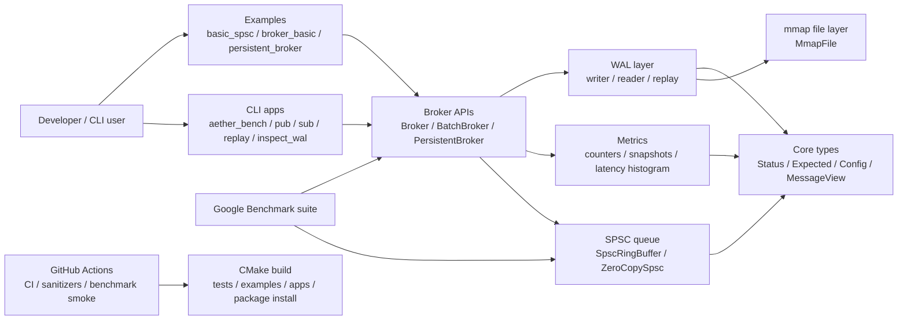
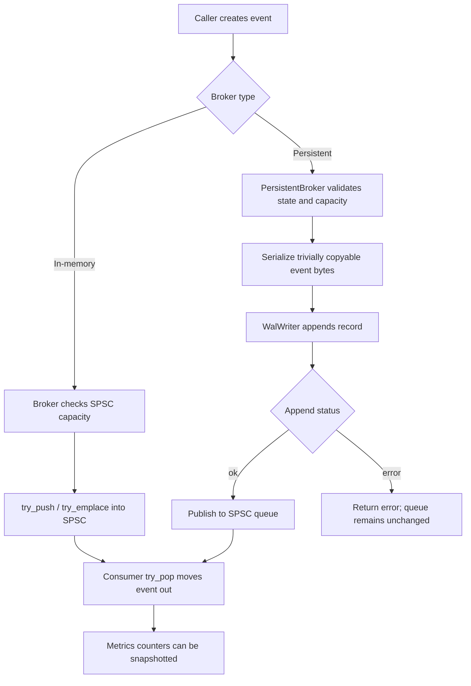

# Aether-Stream Architecture

Aether-Stream is a local C++20 systems project complete through Phase 13. Runtime functionality is the Phase 0-12 implementation; Phase 13 adds final documentation, Mermaid diagrams, limitations, interview notes, and release notes.

## Scope and non-goals

The project demonstrates local messaging primitives: a lock-free SPSC queue, broker wrappers, mmap-backed WAL persistence, CLI demos, metrics, benchmarks, and CI/package verification. It intentionally does not provide networking, live IPC subscriptions, MPSC/MPMC queues, production persistence guarantees, distributed semantics, or unsupported benchmark claims.

## Layered architecture

| Layer | Responsibility |
|---|---|
| Public headers/core API | Version, types, `Status`, `Expected`, configs, and `MessageView`. |
| SPSC queue | `SpscRingBuffer<T, Capacity>` for exactly one producer and one consumer. |
| Broker API | `Broker` and `BatchBroker` compose queue operations into publish/consume APIs. |
| Persistent broker | Validates capacity, appends to WAL, then publishes to the queue. |
| WAL reader/writer | Stable 40-byte v1 header, payload bytes, CRC32 validation, sequential replay. |
| mmap file layer | RAII POSIX file mapping behind `MmapFile`. |
| Metrics/diagnostics | Relaxed-atomic counters, snapshots, latency histogram, CLI summaries. |
| CLI apps | Local demo, WAL publish, typed replay, raw replay, inspection. |
| Benchmarks | Google Benchmark suite for queue, broker, batch, zero-copy, and spin-wait paths. |
| CI/package verification | CMake, CTest, clang-tidy, sanitizers, benchmark smoke, install/export checks. |

## System diagram

## Publish/consume data flow

## Broker data flow

- In-memory broker: `publish -> SPSC queue -> consume`.
- Persistent broker: `validate -> append WAL -> publish to SPSC queue -> consume`.
- Full queue checks happen before WAL append in the persistent broker so a failed queue-capacity check does not create an unconsumable WAL record.
- Typed replay uses the WAL reader path, validates each record, checks payload size against `sizeof(T)`, and reconstructs trivially copyable payloads with byte copy for same-program/same-platform replay.

## Metrics flow

Broker counters use relaxed atomics because they are diagnostic observations, not synchronization barriers. Callers obtain stable value objects with snapshots. CLI apps print concise metrics summaries. `LatencyHistogram` is used for diagnostics and benchmarks; it is not a distributed tracing system or production observability exporter.

## CMake/build target overview

The primary library target is `aether_stream` with public alias `aether::stream`. Optional CMake flags enable tests, examples, tools, CLI apps, benchmarks, sanitizers, clang-tidy, and install/export package rules. CLI executables are emitted under `${CMAKE_BINARY_DIR}/apps`; benchmark executables are emitted under `${CMAKE_BINARY_DIR}/benchmarks`.

## Explicit limitations

- No networking.
- No live inter-process broker service.
- No MPMC queue; the queue is SPSC only.
- No production persistence guarantee beyond explicit WAL append/flush behavior.
- No unsupported benchmark claims; official numbers require raw `./scripts/run_benchmarks.sh` outputs.

## Interview explanation

This architecture is credible because it shows end-to-end ownership of a scoped systems problem: memory ordering, object lifetime, cache layout, mmap resource management, binary format validation, API composition, diagnostics, benchmark reproducibility, and CI. It is also credible because it refuses to overclaim; the project is a local toolkit, not a production distributed broker.
