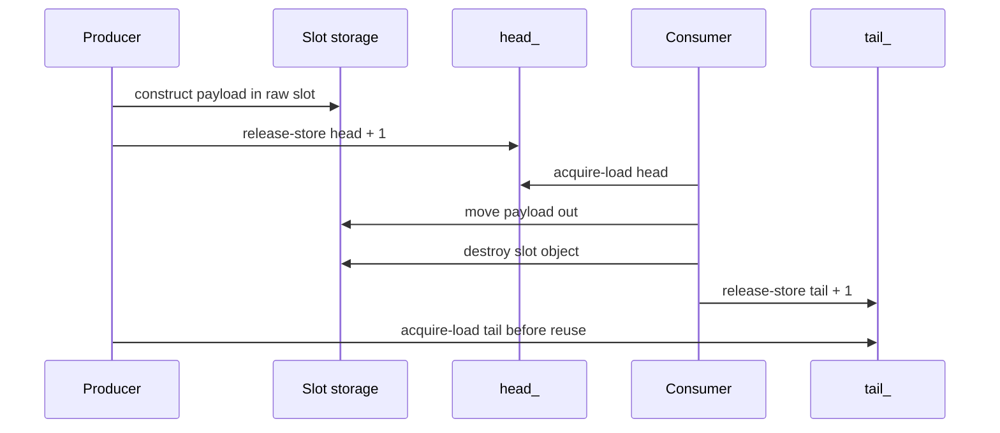

# Memory Ordering in the SPSC Ring Buffer

## Scope

This document explains the acquire/release protocol used by `aether::SpscRingBuffer<T, Capacity>`. It is valid only for exactly one producer thread and exactly one consumer thread.

## Acquire/release table

| Operation | Thread | Memory order | Purpose |
|---|---|---|---|
| Load owned `head_` | Producer | relaxed | Producer is the only writer of `head_`. |
| Load observed `tail_` | Producer | acquire | See consumer's slot destruction before reuse. |
| Store `head_` | Producer | release | Publish constructed payload to consumer. |
| Load observed `head_` | Consumer | acquire | See producer's constructed payload. |
| Load owned `tail_` | Consumer | relaxed | Consumer is the only writer of `tail_`. |
| Store `tail_` | Consumer | release | Publish destruction/reuse permission to producer. |

## Sequence diagram

## Why this is valid only for SPSC

The protocol relies on exclusive ownership:

- only the producer writes `head_`;
- only the consumer writes `tail_`;
- only the producer constructs objects in empty slots;
- only the consumer moves from and destroys live slots.

With multiple producers, producers would race to reserve and publish `head_`. With multiple consumers, consumers would race to reserve and publish `tail_`. Those are different algorithms and require stronger coordination, such as atomic reservation or per-slot sequence numbers.

## Code references

- `include/aether/spsc_ring_buffer.hpp`
- `include/aether/detail/cache_line.hpp`
- `tests/test_spsc_concurrent.cpp`
- `tests/test_spsc_stress.cpp`
- `docs/ring-buffer-design.md`

## Validation status

Phase 11 added CI, sanitizer workflows, clang-tidy integration, benchmark smoke checks, and package install verification. Concurrent and stress tests validate ordered transfer under the SPSC contract. These checks do not make the queue MPSC/MPMC and do not create production or HFT guarantees.

## Plain-English interview summary

“The producer writes the object first and then release-publishes the new head. The consumer acquire-loads that head before reading the object. After consuming and destroying the object, the consumer release-publishes the new tail. The producer acquire-loads that tail before reusing the slot. This is enough because there is exactly one writer for each counter.”
