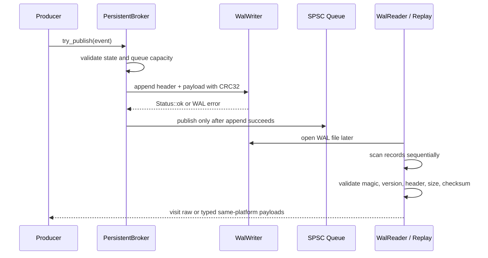

# Aether-Stream WAL Format

## Purpose and scope

The WAL is an append-only local persistence format used by `aether::PersistentBroker<T, Capacity>` and the CLI replay/inspection tools. It stores generic message payload bytes; typed replay is a broker-layer convention for trivially copyable same-program payloads.

## File model

A WAL file is created at a fixed size and mapped with `aether::io::MmapFile`. Writers append records sequentially from offset zero. Unused bytes after the last complete record remain zero-filled in a newly created file.

## Record layout

Each record is a fixed 40-byte header followed by `payload_size` payload bytes. All integer fields are little-endian. Readers and writers serialize fields explicitly rather than relying on raw struct layout.

| Offset | Field | Type | Size | Notes |
| ---: | --- | --- | ---: | --- |
| 0 | `magic` | `uint32_t` | 4 | ASCII bytes `AWAL` |
| 4 | `version` | `uint16_t` | 2 | Format version `1` |
| 6 | `header_size` | `uint16_t` | 2 | Always `40` for v1 |
| 8 | `payload_size` | `uint32_t` | 4 | Number of payload bytes |
| 12 | reserved/padding | bytes | 4 | Must serialize as zero |
| 16 | `sequence` | `uint64_t` | 8 | Writer-assigned sequence |
| 24 | `timestamp_ns` | `uint64_t` | 8 | Message timestamp or monotonic append timestamp |
| 32 | `checksum` | `uint32_t` | 4 | CRC32 checksum |
| 36 | `flags` | `uint32_t` | 4 | Message flags |

`record_total_size = 40 + payload_size`.

## Example record layout

```text
+----------------------+ 40-byte v1 header
| magic/version/size   |
| sequence/timestamp   |
| checksum/flags       |
+----------------------+ payload_size bytes
| payload bytes        |
+----------------------+
| next record or       |
| zero-filled tail     |
+----------------------+
```

The checksum is a header field, not a trailer. It covers the serialized header with the checksum field set to zero plus the payload bytes.

## WAL append and replay flow



## Checksum policy

Records use standard IEEE CRC32:

- polynomial: `0xEDB88320`;
- initial value: `0xFFFFFFFF`;
- final XOR: `0xFFFFFFFF`.

A checksum mismatch returns `StatusCode::corrupted_record`.

## Reader behavior

- Zero-filled tail after the last valid record is clean EOF and returns `StatusCode::empty`.
- Incomplete header or payload at the tail is treated as a clean stop and returns `StatusCode::empty` with detail.
- Invalid magic, unsupported version, invalid header size, or checksum mismatch returns `StatusCode::corrupted_record`.
- The reader never reads beyond mapped file bounds.

## Persistent broker WAL-before-queue semantics

`PersistentBroker<T, Capacity>` validates broker state and queue capacity, serializes the trivially copyable event representation, appends the record to the WAL, and publishes to the in-memory SPSC queue only after WAL append succeeds. If WAL append fails, the event is not published to the queue.

## Typed replay limitations

Typed replay is intentionally narrow:

- same-program/same-platform only;
- trivially copyable payloads only;
- no ABI-independent schema;
- no cross-language schema;
- no schema evolution.

## What corruption/recovery means in this project

- Zero-filled tail = clean EOF.
- Incomplete tail = clean stop.
- Invalid magic/version/header/checksum = corrupted record.
- There is no repair or truncation tooling.
- There is no production crash-recovery guarantee beyond explicit append/flush behavior.

## CLI inspection and replay

`aether_replay` prints generic raw WAL summaries. `aether_inspect_wal` scans format/count/offset information. These tools do not repair corrupted files or rotate WAL segments.
